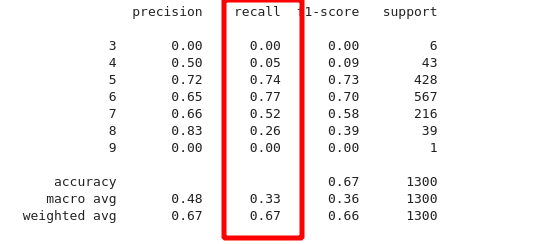
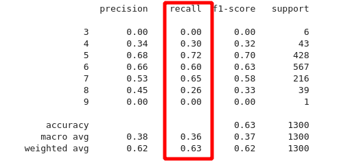
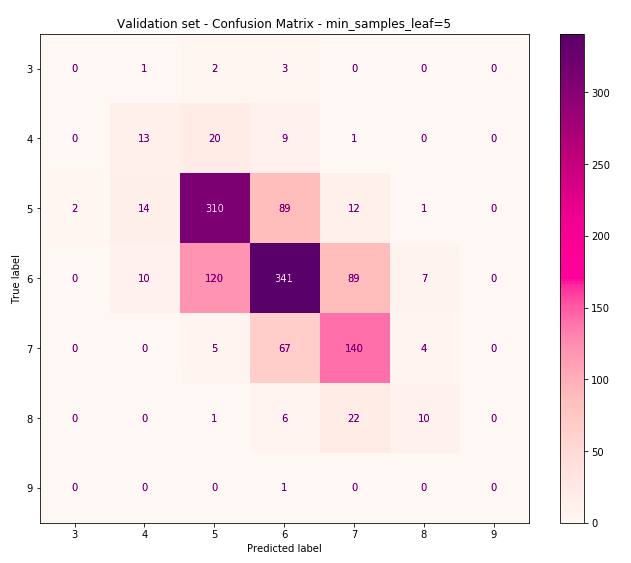
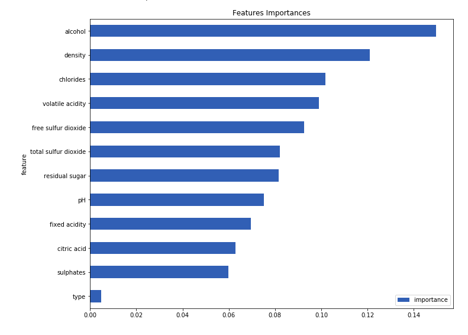

# Descrição do problema

> O presente problema se refere aos dados de vinhos portugueses
> "Vinho Verde", que possuem variantes de vinho branco e tinto.
> Devido a questões de privacidade, apenas variáveis
> físico-químicas (input) e sensoriais (output) estão disponíveis (por
> exemplo, não há dados sobre tipo de uva, marca do vinho, preço
> de venda, etc).

# Estratégia de modelagem

Classificador multi-classe que prevê a qualidade do vinho. O output é um score de qualidade (0-10) e o input são as propriedades físico-químicas do vinho.
 
O dataset foi dividido de forma estratificada (80-20%) para validação do modelo.

>NOTA: como o dataset é desbalanceado e algumas classes estão faltando, as predições ficam limitadas as notas entre 3-9.

## Seleção do modelo

Os modelos foram testados com os parâmetros de default alterando apenas `max_iter` para convergência. A métrica utilizada foi `recall macro` que é a média do `recall` de cada uma das classe. 

| model                  | recall_macro |      std |
| :--------------------- | :----------: | -------: |
| RandomForestClassifier |   0.329910   | 0.005923 |
| LinearSVC              |   0.198112   | 0.003349 |
| SVC                    |   0.227329   | 0.003360 |
| KNeighborsClassifier   |   0.264867   | 0.003554 |

## Tunning

Por default os parâmetros do RandomForestClassifier overfita o modelo. Para melhorar a generalização foi adicionado os seguintes parâmetros:
* class_weight = 'balanced'
* min_sample_leaf = 5

Veja o comparativo:

## RandomForestClassifier Default

## RandomForestClassifier Tunning

Com o ajuste, a classe 4 melhorou o `recall` em 25% e as previsões da classe 7 também. No geral a classificação ficou melhor distribuída, reduzindo o bias das classes dominantes 5 e 6.

## Matrix de Confusão

Veja que o output é um sensorial e pode variar de pessoa para pessoa. Nesse caso considerei razoável cometer erros de classificação quando o score de qualidade estiver muito próximo um do outro. Na matrix de confusão, isso implica em manter o máximo possível de acertos próximos a diagonal principal.

## Importância das Features

Um outro dado interessante é a importância das features do modelo. As features com maior importância também tem a maior correlação com score de qualidade. Isso era o esperado, o resultado mostra uma boa sanidade do modelo. 
